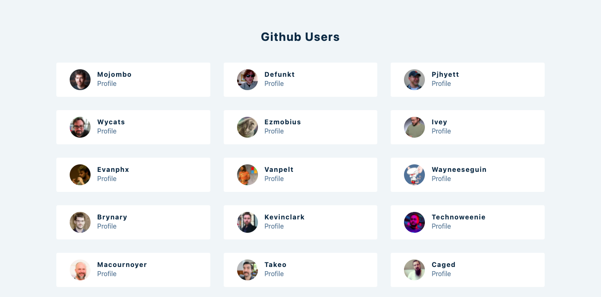

## React github users app

View Live: https://react-github-users-shubham.netlify.app/

In this app is a good example of fetching data from a source and then using it to display and manipulate data using React.js.

### Screenshot

